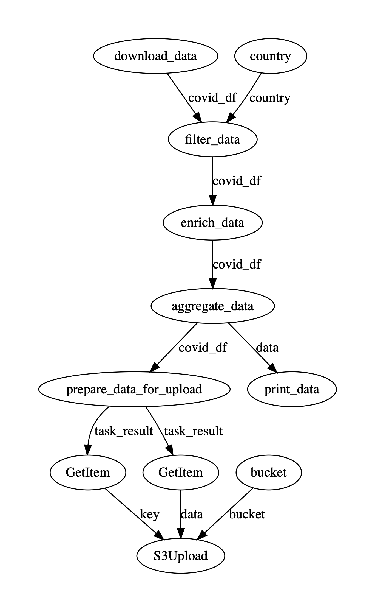

# Prefect demo flow

This is the code accompanying the blog [article](https://makeitnew.io/prefect-a-modern-python-native-data-workflow-engine-7ece02ceb396). It defines a Prefect flow which can be visualized, run locally or registers in Prefect cloud.

The input data are OpenData for COVID and the output an monthly aggregated CSV in S3 for a specific country.

# Installation

```
poetry install
poetry run demo-flow --help
```

Without poetry:
```
virtualenv -p python3 venv && source venv/bin/activate
pip install -r requirements.txt
```

# Usage

```
Usage: demo-flow [OPTIONS] COMMAND [ARGS]...

Options:
  --help  Show this message and exit.

Commands:
  register-flow
  run-local
  run-with-cloud
  start-agent
  visualize
```

# Local run

```
# With poetry
poetry run demo-flow run-local --bucket <s3-bucket>

# Without poetry
PYTHONPATH="." python demo_flow/cli.py run-local --bucket <s3-bucket>
```

# Run via cloud on local agent

To let the final upload to S3 succeed make sure to have an active connection to AWS
and that the given AWS S3 bucket exists

```
prefect auth login -t <personal-access-token>
export PREFECT__CLOUD__AGENT__AUTH_TOKEN=<runner-token>
export PREFECT__FLOWS__CHECKPOINTING=true

# With poetry
poetry run demo-flow run-with-cloud --bucket <s3-bucket>

# Without poetry
PYTHONPATH="." python demo_flow/cli.py run-with-cloud --bucket <s3-bucket>
```

# Flow DAG


